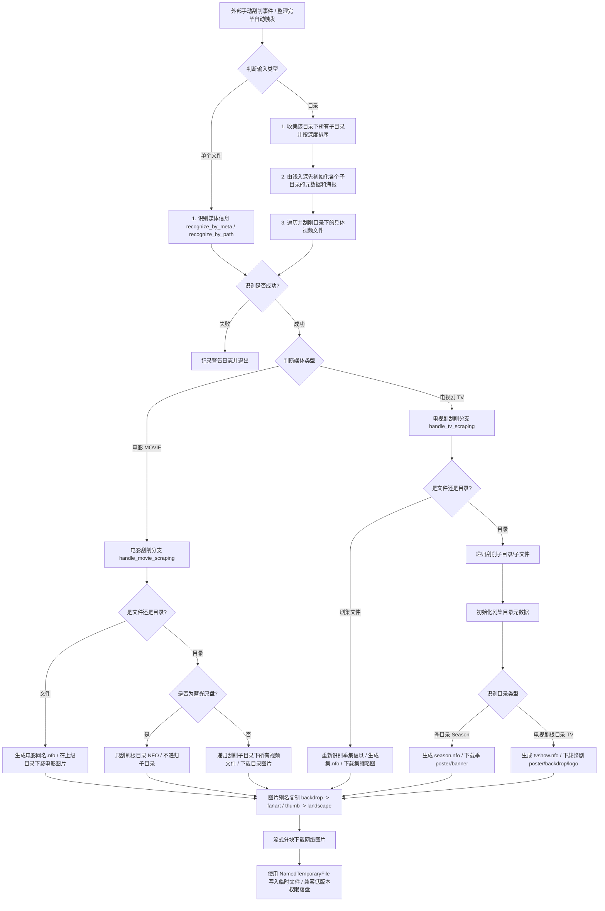
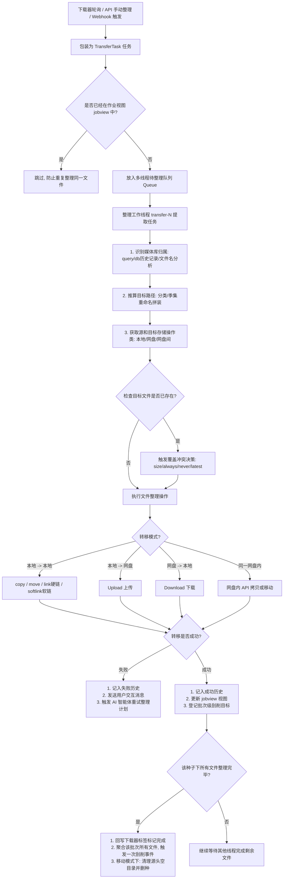

# MoviePilot 刮削功能与文件整理功能深度解析报告

本报告旨在用通俗易懂的语言（大白话）和逻辑清晰的流程图，为您梳理 MoviePilot Python 代码中两大核心功能——**刮削功能**与**文件整理功能**的核心业务步骤、入参、出参，以及代码所考虑到的各种边界情况（Edge Cases）。

---

## 一、 媒体刮削功能（Scraping）

### 1.1 什么是“刮削”？（大白话解释）
**刮削（Scraping）**是指当您下载好一部电影或电视剧后，程序根据视频的名字或路径，去国外的 TMDB（The Movie Database）或国内的豆瓣等网站，把这部电影的海报、背景图、演员表、简介、评分等元数据“刮”下来，并保存为本地的图片和 `.nfo` 信息文件。
这样，当您使用 Plex、Emby 或 Jellyfin 等媒体服务器时，它们就能直接读取这些本地文件，完美呈现出精美的“海报墙”。

### 1.2 刮削核心业务步骤流程图
以下是 MoviePilot 中刮削功能从触发到文件落盘的核心逻辑流程：

### 1.3 核心方法入参及出参
主要业务方法位于 [media.py](file:///Users/guojc/Documents/UGit/bujic-movie/reference/MoviePilot/app/chain/media.py#L1161-L1226) 中的 `scrape_metadata`。

| 参数名 | 类型 | 必须 | 大白话释义 |
| :--- | :--- | :--- | :--- |
| **fileitem** | `FileItem` | 是 | **刮削目标**：需要进行刮削的文件或目录对象（包含路径、存储类型如本地/云盘等）。 |
| **meta** | `MetaBase` | 否 | **元数据对象**：文件名初步解析出的名称、年份、季集等信息。若为空则从 `fileitem` 的路径自动重新解析。 |
| **mediainfo** | `MediaInfo` | 否 | **匹配到的媒体库信息**：TMDB 或豆瓣的真实数据（如 TMDB ID）。若为空则由程序拿 `meta` 去网络检索并自动识别绑定。 |
| **init_folder** | `bool` | 否 | **是否初始化根目录**：如果为 True，会下载海报、背景图等目录级文件；若为 False，则只针对视频生成 `.nfo` 文件。默认值为 True。 |
| **parent** | `FileItem` | 否 | **上级目录对象**：有些电影文件在子文件夹中，需要获取父文件夹对象以便把海报存在父目录下。 |
| **overwrite** | `bool` | 否 | **是否强制覆盖**：如果已有 `.nfo` 或图片，是否重新下载覆盖。默认值为 False（仅刮削缺失文件）。 |
| **recursive** | `bool` | 否 | **是否递归处理**：在传入目录时，是否深入遍历子目录和所有视频文件。默认值为 True。 |

* **出参（返回值）**：`None`。
  * **作用效果**：通过 `storagechain` 接口，流式下载图片及生成 NFO 文本，最终写入/上传到媒体库指定位置。若发生严重错误（如网络断开、无法匹配媒体）则抛出异常或在日志中打印 `Warning` 并安全退出。

---

### 1.4 刮削考虑的边界情况（Edge Cases）

#### ① 蓝光原盘目录（BDMV）的防破坏保护
> [!IMPORTANT]
> 蓝光原盘目录通常包含 `BDMV/STREAM` 等复杂目录结构。如果像普通目录那样递归进入每个目录去乱改文件名或塞入海报，会直接破坏原盘结构导致播放器无法识别。
> **代码解决**：在 `scrape_metadata_event` 和 `_handle_movie_directory` 中会检查 `is_bluray_folder`。若是原盘，则**只对根目录刮削 NFO 和海报**，不再递归进入子目录，确保原盘完整性。

#### ② 电视剧“季目录”与“剧集根目录”的防混淆机制
> [!NOTE]
> 电视剧通常是 `电视剧名字/Season 1/S01E01.mp4` 这种三级结构。剧集根目录需要生成 `tvshow.nfo`，而季目录需要生成 `season.nfo` 和该季的海报。如何区分？
> **代码解决**：在 `_initialize_tv_directory_metadata` 中，代码通过正则提取目录名。若包含 `Season 1` 或配置 of SP（花絮）名称，则按 `SEASON` 目标刮削；否则按 `TV`（剧集根目录）刮削。
> 并且专门排除了解析辅助词引起的误判（如文件名带 `#` 号的自定义词，避免把正常的剧集根目录误识别为季目录，修复了 Github Issue #5501 和 #5373）。

#### ③ 媒体服务器兼容性：图片别名复制
> [!TIP]
> 不同的播放软件对图片命名的喜好不同。比如 Plex 喜欢 `backdrop.jpg`（背景），而 Emby/Jellyfin 更青睐 `fanart.jpg`；Kodi 喜欢 `thumb.jpg`，而其他系统可能用 `landscape.jpg`。
> **代码解决**：在 `_expand_with_aliases` 中，定义了别名映射（如 `backdrop` $\leftrightarrow$ `fanart`，`thumb` $\leftrightarrow$ `landscape`）。下载完一张图后，会自动在同级目录复制/上传一份别名文件，实现“一份下载，全家桶兼容”。

#### ④ 季级图片的精确匹配过滤
> [!NOTE]
> 当我们刮削电视剧的某一季（例如 Season 2）时，TMDB 会返回一整部剧的所有图片链接，包括 Season 1、Season 2 的海报。
> **代码解决**：在 `_scrape_images_generic` 中，程序会自动解析图片名中的季号（如 `season02-poster.jpg`），**如果图片季号与当前刮削的季号不一致，则直接跳过**，防止把第一季的海报覆盖写入到第二季的目录中。

#### ⑤ 低版本 Python 的兼容性落盘
> [!WARNING]
> Python 3.12 引入了临时文件 `NamedTemporaryFile` 的 `delete_on_close` 参数，但在旧版本 Python 中使用此参数会导致程序崩溃。
> **代码解决**：在 `_save_file` 和 `_download_and_save_image` 中，MoviePilot 将 `delete` 设为 `False`，在写入成功后利用 `try...finally` 块**显式调用 `unlink()` 进行手动删除清理**，保证了在 Python 3.10/3.11 上的向下兼容性。同时在落盘前使用位运算 `0o666 & ~current_umask` 统一重置文件权限，防止因权限不足导致媒体服务器无法读取。

---
---

## 二、 文件整理功能（File Transfer/Organization）

### 2.1 什么是“文件整理”？（大白话解释）
**文件整理（Transfer）**是指下载器（如 qBittorrent/Transmission）把电影下载完成后，程序自动把它从“下载完成目录”转移到“媒体库目录”。
在这个转移过程中，它会完成**重命名**（把杂乱的文件名改成标准的 `电影名 (年份) [1080p].mp4`）、**分类归档**（放进电影或电视剧文件夹）、**字幕适配**，并触发上述的**刮削**动作。

### 2.2 文件整理核心业务步骤流程图
以下展示了文件整理的并发队列流转及整理后的聚合逻辑：

### 2.3 核心方法入参及出参
主要业务方法位于 [transhandler.py](file:///Users/guojc/Documents/UGit/bujic-movie/reference/MoviePilot/app/modules/filemanager/transhandler.py#L130-L577) 中的 `transfer_media`。

| 参数名 | 类型 | 必须 | 大白话释义 |
| :--- | :--- | :--- | :--- |
| **fileitem** | `FileItem` | 是 | **整理源文件**：当前下载完成、待移动或链接的源视频文件/原盘目录。 |
| **in_meta** | `MetaBase` | 是 | **初步识别的元数据**：文件名中携带的名称、年份等。 |
| **mediainfo** | `MediaInfo` | 是 | **匹配的真实媒体信息**：TMDB 数据。 |
| **target_storage** | `str` | 是 | **目标存储类型**：如 `local`（本地磁盘）或云盘标识。 |
| **target_path** | `Path` | 是 | **整理目的基础路径**：如 `/media/电影`。 |
| **transfer_type** | `str` | 是 | **转移模式**：支持 `copy`（复制）、`move`（移动）、`link`（硬链接）、`softlink`（软链接）。 |
| **source_oper** | `StorageBase` | 是 | **源头存储操作类**：用于读取、移动或删除源文件的具体接口驱动。 |
| **target_oper** | `StorageBase` | 是 | **目标存储操作类**：用于在目的地创建文件夹、写入文件的接口驱动。 |
| **need_scrape** | `bool` | 否 | **是否在整理后开启刮削**。默认值为 False。 |
| **need_rename** | `bool` | 否 | **是否执行重命名**：若为 False，转移后保留下载时的原始文件名。默认值为 True。 |
| **overwrite_mode** | `str` | 否 | **覆盖冲突模式**：`always`（总是覆盖）、`size`（大覆盖小）、`never`（不覆盖）、`latest`（仅保留最新版本）。 |
| **episodes_info** | `List[TmdbEpisode]`| 否 | **整季剧集数据**：用于精准匹配重命名时的单集标题。 |
| **preview** | `bool` | 否 | **是否仅预览**：如果为 True，只通过算法推算并返回整理后的文件名和路径，不进行任何实际的文件写入/转移。默认值为 False。 |

* **出参（返回值）**：`TransferInfo` 结构体。包含以下核心字段：
  * `success`: 是否成功。
  * `message`: 错误或成功提示。
  * `file_list`: 源文件路径列表。
  * `file_list_new`: 整理后的新文件路径列表。
  * `total_size`: 整理的文件总大小。

---

### 2.4 文件整理考虑的边界情况（Edge Cases）

#### ① 电视剧蓝光原盘（TV Blu-ray）目录的 Disc 盘符追加
普通电视剧整理时可以根据第几集命名（如 `S01E01.mp4`），但**电视剧原盘目录是没有单集文件名的**，它是一个包含了整张光盘内容的文件夹。
* **代码解决**：在 `__get_tv_bluray_dir_path` 中，程序在重命名时会保留电视剧的“季目录”（如 `Season 1`），然后通过正则分析源目录名或 `meta`，提取出 `Disc 1`、`Disc 2`（或SP花絮盘），并在季目录下为它们**单独创建盘片子目录**存放，防止多张原盘文件冲突覆盖。

#### ② 覆盖冲突时的 4 种智能决策
目的地如果已经存在同名文件，程序不会简单粗暴地报错，而是根据 `overwrite_mode` 提供了多种精细化处理：
* `always`：先删除已存在的目标文件，然后重新整理写入。
* `never`：直接放弃本次整理，报错并退出。
* `size`（大小比对）：**只有当源视频文件的大小大于已存在的目标文件时才执行覆盖**。这通常用于“高码率/高清版本”自动替换“低画质版本”的场景，防止好资源被差资源意外覆盖。
* `latest`（仅保留最新版本）：
  > [!WARNING]
  > 在开启最新版本覆盖时，稍有不慎就会把用户自己配置的字幕文件或者外挂音频一起删掉。
  > **代码解决**：在 `__delete_version_files` 中，程序会先提取当前视频的“季、集、分部（Part）”信息，**只过滤并删除媒体库内视频格式（`settings.RMT_MEDIAEXT`）的同季同集旧视频**，字幕及其他文件不会被波及（修复了 Issue #5449 和 #5862 中关于误删字幕和多 Part 视频的 Bug）。

#### ③ AI 智能体合并防抖与重试整理
如果因为 TMDB 接口限制或临时网络抖动，导致文件“未识别到媒体信息，无法入库”：
* **代码解决**：如果开启了 AI 重试（`AI_AGENT_RETRY_TRANSFER`），程序会使用 `download_hash`（种子哈希）或源文件父目录作为分组键（`group_key`），在**缓冲区内进行防抖（Debounce）合并**（默认防抖时间为 15 秒）。
* 这样，同一批次（如同一个种子下的多集）失败的记录只会被合并成一次 AI 重试 Prompt 提交给智能体处理，**极大地节省了 Token 开销和系统并发资源**。

#### ④ 批次级刮削缓冲防抖（防止垃圾日志和磁盘扫盘过载）
* **场景**：如果我们下载了一部包含 24 集的电视剧，整理线程会多线程并发转移这 24 个文件。如果每转完一集就触发一次媒体库全量刮削，会导致短时间内磁盘/网盘 API 被请求 24 次，甚至引起网盘限流或系统卡死。
* **代码解决**：MoviePilot 引入了批次注册机制（`__register_scrape_batch_task` 和 `__close_scrape_batch`）。刮削事件只在批次关闭、且该批次内所有文件的整理任务全部成功后，**统一聚合为一次 `MetadataScrape` 事件发送**，实现“只刮削一次”，完美解决了磁盘 IO 抖动问题。

#### ⑤ 字幕语言智能识别与重命名防误判
外挂字幕的语言多种多样，如何正确地为它们打上 `.zh-cn`（简中）、`.zh-tw`（繁中）、`.ja`（日文）、`.eng`（英文）等媒体服务器能认出来的后缀？
* **代码解决**：在 `__rename_subtitles` 中定义了多国语言的超长正则表达式。
* **边界处理**：代码中**优先匹配繁体中文规则（zhtw_sub_re）**。这是因为“繁体中文”或“繁中字”里包含“中文”或“中字”两个字，如果先跑简体中文（简中/中文/中字）的正则，繁体字幕就会被简中规则误判。通过调整匹配优先级，彻底解决了简繁字幕混淆的问题。

#### ⑥ 移动模式（Move）下的尾部清理
* **代码解决**：当整理模式设置为 `move` 时，在所有文件转移成功并确认为 `is_torrent_success` 后，程序会自动调用 `remove_torrents` 告知下载器**删除种子并清理文件**，同时调用存储操作类**递归删除源头遗留下的空文件夹**，保持下载盘干干净净。
