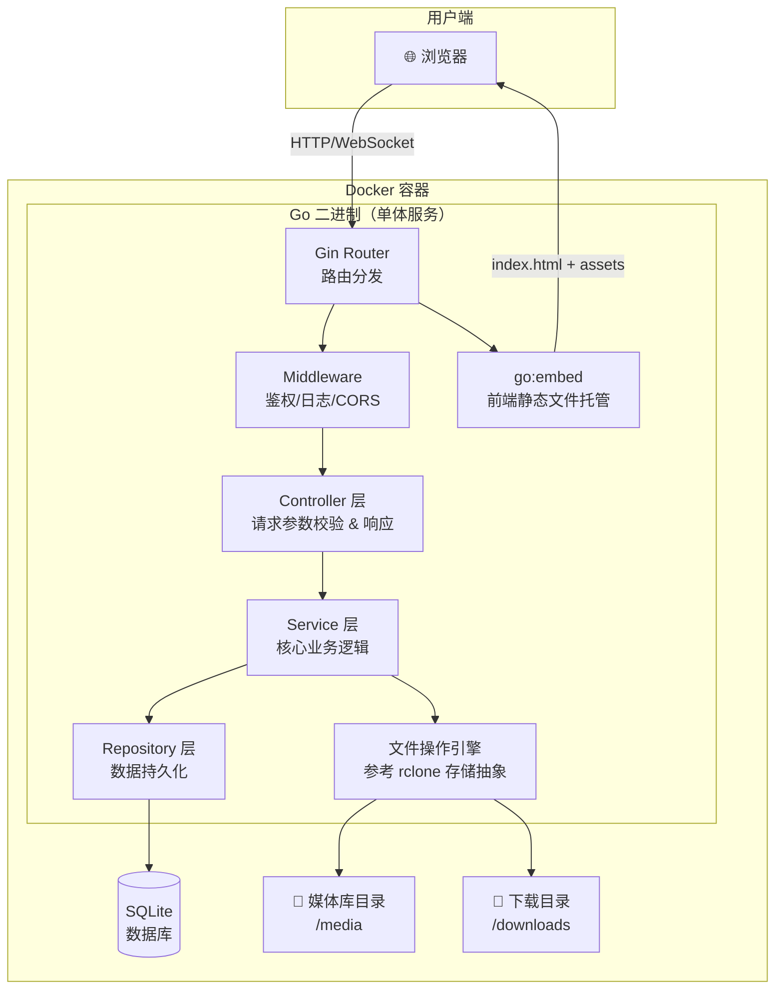
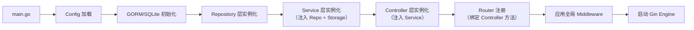
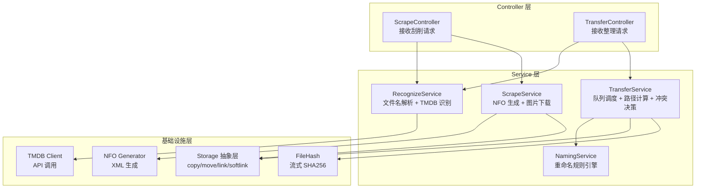

# Bujic Movie — 项目架构设计文档

> **项目定位**：一个轻量级、自托管的媒体文件管理工具，实现电影/电视剧的**自动刮削**（元数据抓取）和**文件整理**（重命名、归档、转移），并通过 Web UI 提供可视化操作界面。

---

## 一、 整体架构鸟瞰



---

## 二、 技术栈选型

| 层级 | 技术 | 选型理由 |
|:---|:---|:---|
| **后端框架** | Go + Gin | 高性能、单二进制部署、生态成熟 |
| **项目分层** | Router → Controller → Service → Repository | 参考 `golang-gin-realworld-example-app`，职责清晰 |
| **文件操作** | 自研存储抽象层（参考 rclone 的 `Fs`/`Object` 接口模式） | 统一本地/网盘操作，可扩展 |
| **文件哈希** | `crypto/sha256` + `io.Copy` 流式处理 | 参考 go-hasher 模式，低内存开销 |
| **数据库** | SQLite（通过 GORM） | 零配置、适合自托管场景、单文件数据库 |
| **前端框架** | Vue 3 + Vite + TypeScript | 现代化、编译极快、生态丰富 |
| **UI 组件库** | shadcn-vue + Tailwind CSS | 高度可定制、设计精美、原子化 CSS |
| **前端设计** | frontend-ui-ux Skill | 高级设计美学，打造沉浸式媒体管理体验 |
| **前后端集成** | `go:embed` 嵌入前端 `dist/` 产物 | 单二进制、无需额外 Web 服务器 |
| **容器化** | Docker 多阶段构建 | 前端构建 → Go 编译 → 最终镜像（Alpine） |
| **配置管理** | YAML + 环境变量 | 灵活支持 Docker Compose 和裸机部署 |

---

## 三、 后端目录结构（Go）

遵循 `golang-gin-realworld-example-app` 的分层最佳实践，结合 rclone 存储抽象思想：

```
bujic-movie/
├── cmd/                          # 应用入口
│   └── server/
│       └── main.go               # 程序入口：初始化 DB、DI 注入、启动 Gin
│
├── internal/                     # 私有应用代码（不对外暴露）
│   ├── config/                   # 配置加载与管理
│   │   └── config.go             # YAML + 环境变量读取
│   │
│   ├── middleware/                # Gin 中间件
│   │   ├── auth.go               # JWT/Token 鉴权
│   │   ├── cors.go               # 跨域配置
│   │   ├── logger.go             # 请求日志
│   │   └── recovery.go           # Panic 恢复
│   │
│   ├── router/                   # 路由注册
│   │   └── router.go             # 按模块分组注册所有路由
│   │
│   ├── controller/               # 控制器层（HTTP Handler）
│   │   ├── scrape_controller.go  # 刮削相关接口
│   │   ├── transfer_controller.go# 文件整理相关接口
│   │   ├── media_controller.go   # 媒体库浏览接口
│   │   ├── setting_controller.go # 系统设置接口
│   │   └── task_controller.go    # 后台任务查询接口
│   │
│   ├── service/                  # 业务逻辑层（核心"大脑"）
│   │   ├── scrape_service.go     # 刮削业务：识别 → 下载元数据 → 生成 NFO
│   │   ├── transfer_service.go   # 整理业务：队列管理 → 路径计算 → 文件转移
│   │   ├── media_service.go      # 媒体库查询与搜索
│   │   ├── recognize_service.go  # 文件名解析 & TMDB 媒体识别
│   │   ├── naming_service.go     # 重命名规则引擎
│   │   └── setting_service.go    # 配置读写
│   │
│   ├── repository/               # 数据持久化层
│   │   ├── media_repo.go         # 媒体记录 CRUD
│   │   ├── transfer_history_repo.go # 整理历史记录
│   │   └── setting_repo.go       # 系统配置存储
│   │
│   ├── model/                    # 数据模型定义
│   │   ├── entity/               # 数据库实体（GORM Model）
│   │   │   ├── media.go          # 媒体条目
│   │   │   ├── transfer_history.go # 整理历史
│   │   │   └── setting.go        # 系统配置
│   │   ├── dto/                  # 数据传输对象（请求/响应）
│   │   │   ├── scrape_request.go
│   │   │   ├── transfer_request.go
│   │   │   └── media_response.go
│   │   └── enum/                 # 枚举与常量
│   │       ├── media_type.go     # MOVIE / TV
│   │       └── transfer_mode.go  # COPY / MOVE / LINK / SOFTLINK
│   │
│   └── storage/                  # 存储抽象层（参考 rclone 设计）
│       ├── storage.go            # Storage 接口定义（Fs + Object 抽象）
│       ├── local/                # 本地文件系统实现
│       │   └── local.go          # os 包操作：copy/move/link/softlink
│       └── registry.go           # 存储后端注册表
│
├── pkg/                          # 可复用的公共包
│   ├── fileutil/                 # 文件工具
│   │   ├── hash.go               # 流式文件哈希（SHA256）
│   │   ├── walk.go               # 目录遍历与过滤
│   │   └── permission.go         # 权限检查与修复
│   ├── nfo/                      # NFO 文件生成器
│   │   ├── generator.go          # XML 模板生成 .nfo 文件
│   │   └── templates/            # NFO XML 模板
│   ├── tmdb/                     # TMDB API 客户端
│   │   ├── client.go             # HTTP 请求封装
│   │   ├── model.go              # API 数据模型
│   │   └── image.go              # 图片 URL 构建与下载
│   ├── parser/                   # 文件名解析器
│   │   ├── filename_parser.go    # 正则解析影片名、年份、分辨率等
│   │   └── subtitle_parser.go    # 字幕语言识别（简繁中日英）
│   └── response/                 # 统一响应格式
│       └── response.go           # JSON 响应封装（code/msg/data）
│
├── web/                          # 前端源码（Vue 3 项目）
│   └── (详见前端目录结构)
│
├── dist/                         # 前端构建产物（被 go:embed 嵌入）
│   └── (npm run build 输出)
│
├── configs/                      # 配置文件模板
│   └── config.yaml.example       # 配置文件示例
│
├── deployments/                  # 部署相关
│   ├── Dockerfile                # 多阶段 Docker 构建
│   └── docker-compose.yml        # 一键启动编排
│
├── doc/                          # 项目文档
│   ├── moviepilot_scraping_and_transfer_analysis.md
│   ├── project_architecture.md   # 本文档
│   └── task_execution_plan.md    # 任务执行计划
│
├── reference/                    # 参考代码（MoviePilot 等）
│   └── MoviePilot/
│
├── go.mod
├── go.sum
├── Makefile                      # 构建脚本：build / dev / docker
└── README.md
```

---

## 四、 前端目录结构（Vue 3 + Vite + shadcn-vue）

```
web/
├── public/                       # 公共静态资源
│   └── favicon.ico
│
├── src/
│   ├── assets/                   # 静态资源（字体、全局 CSS、图标）
│   │   ├── fonts/
│   │   └── styles/
│   │       └── global.css        # 全局样式 + CSS 变量
│   │
│   ├── components/               # 组件
│   │   ├── ui/                   # shadcn-vue 基础组件（Button, Card, Input 等）
│   │   ├── layout/               # 布局组件
│   │   │   ├── AppSidebar.vue    # 侧边栏导航
│   │   │   ├── AppHeader.vue     # 顶部栏
│   │   │   └── AppLayout.vue     # 整体布局框架
│   │   ├── media/                # 媒体相关业务组件
│   │   │   ├── MediaCard.vue     # 媒体卡片（海报展示）
│   │   │   ├── MediaGrid.vue     # 媒体网格列表
│   │   │   └── MediaDetail.vue   # 媒体详情面板
│   │   ├── scrape/               # 刮削相关组件
│   │   │   ├── ScrapePanel.vue   # 刮削操作面板
│   │   │   └── ScrapeProgress.vue# 刮削进度条
│   │   └── transfer/             # 文件整理相关组件
│   │       ├── TransferQueue.vue # 整理队列列表
│   │       ├── TransferConfig.vue# 整理配置表单
│   │       └── FileBrowser.vue   # 文件浏览器树形控件
│   │
│   ├── pages/                    # 页面级组件（路由视图）
│   │   ├── DashboardPage.vue     # 仪表盘首页
│   │   ├── MediaLibraryPage.vue  # 媒体库浏览页
│   │   ├── ScrapePage.vue        # 刮削管理页
│   │   ├── TransferPage.vue      # 文件整理页
│   │   ├── TaskPage.vue          # 后台任务页
│   │   └── SettingPage.vue       # 系统设置页
│   │
│   ├── composables/              # Vue 3 组合式函数
│   │   ├── useMedia.ts           # 媒体数据逻辑
│   │   ├── useScrape.ts          # 刮削操作逻辑
│   │   ├── useTransfer.ts        # 文件整理逻辑
│   │   └── useWebSocket.ts       # WebSocket 实时通信
│   │
│   ├── api/                      # API 请求封装
│   │   ├── client.ts             # Axios 实例 + 拦截器
│   │   ├── media.ts              # 媒体库 API
│   │   ├── scrape.ts             # 刮削 API
│   │   ├── transfer.ts           # 整理 API
│   │   └── setting.ts            # 设置 API
│   │
│   ├── stores/                   # Pinia 状态管理
│   │   ├── media.ts              # 媒体库状态
│   │   ├── task.ts               # 任务队列状态
│   │   └── app.ts                # 全局应用状态（主题、侧边栏）
│   │
│   ├── router/                   # Vue Router 路由定义
│   │   └── index.ts
│   │
│   ├── lib/                      # 工具库
│   │   └── utils.ts              # shadcn-vue 的 cn() 函数等
│   │
│   ├── App.vue                   # 根组件
│   └── main.ts                   # 应用入口
│
├── index.html
├── vite.config.ts
├── tailwind.config.ts
├── tsconfig.json
├── package.json
└── components.json               # shadcn-vue 配置
```

---

## 五、 后端核心模块设计

### 5.1 分层依赖注入流程



### 5.2 存储抽象层接口设计（参考 rclone）

```go
// internal/storage/storage.go
package storage

// Storage 定义存储后端的统一操作接口
// 参考 rclone 的 Fs 接口设计，屏蔽底层存储差异
type Storage interface {
    // 文件操作
    List(path string) ([]FileItem, error)          // 列出目录内容
    Read(path string) (io.ReadCloser, error)       // 读取文件流
    Write(path string, r io.Reader) error          // 写入文件
    Delete(path string) error                      // 删除文件/目录
    Mkdir(path string) error                       // 创建目录
    Stat(path string) (FileItem, error)            // 获取文件信息

    // 高级操作
    Copy(src, dst string) error                    // 复制
    Move(src, dst string) error                    // 移动
    Link(src, dst string) error                    // 硬链接
    Symlink(src, dst string) error                 // 软链接

    // 元信息
    Hash(path string) (string, error)              // 流式计算文件哈希
    IsDir(path string) bool                        // 判断是否为目录
    IsBluray(path string) bool                     // 判断是否为蓝光原盘目录
}

// FileItem 统一文件信息结构
type FileItem struct {
    Path     string
    Name     string
    Size     int64
    IsDir    bool
    ModTime  time.Time
}
```

### 5.3 API 路由设计

```
API 前缀: /api/v1

┌──────────────────────────────────────────────────────────┐
│ 媒体库 API                                                │
├──────────────────────────────────────────────────────────┤
│ GET    /api/v1/media                 # 获取媒体列表       │
│ GET    /api/v1/media/:id             # 获取媒体详情       │
│ GET    /api/v1/media/search?q=       # 搜索媒体           │
│ DELETE /api/v1/media/:id             # 删除媒体记录       │
├──────────────────────────────────────────────────────────┤
│ 刮削 API                                                  │
├──────────────────────────────────────────────────────────┤
│ POST   /api/v1/scrape                # 触发刮削任务       │
│ POST   /api/v1/scrape/recognize      # 识别媒体信息       │
│ GET    /api/v1/scrape/status/:taskId # 查询刮削状态       │
├──────────────────────────────────────────────────────────┤
│ 文件整理 API                                               │
├──────────────────────────────────────────────────────────┤
│ POST   /api/v1/transfer              # 提交整理任务       │
│ POST   /api/v1/transfer/preview      # 预览整理结果       │
│ GET    /api/v1/transfer/queue        # 查看整理队列       │
│ GET    /api/v1/transfer/history      # 查看整理历史       │
│ DELETE /api/v1/transfer/:id          # 取消/删除整理任务   │
├──────────────────────────────────────────────────────────┤
│ 文件浏览 API                                               │
├──────────────────────────────────────────────────────────┤
│ GET    /api/v1/files?path=           # 浏览目录结构       │
│ GET    /api/v1/files/info?path=      # 获取文件详情       │
├──────────────────────────────────────────────────────────┤
│ 系统设置 API                                               │
├──────────────────────────────────────────────────────────┤
│ GET    /api/v1/settings              # 获取全部配置       │
│ PUT    /api/v1/settings              # 更新配置           │
├──────────────────────────────────────────────────────────┤
│ 实时通信                                                   │
├──────────────────────────────────────────────────────────┤
│ WS     /api/v1/ws                    # WebSocket 任务进度  │
└──────────────────────────────────────────────────────────┘

静态文件路由:
│ GET    /*                            # 非 /api 路径 → Vue SPA │
```

### 5.4 核心业务流程映射

将 MoviePilot 分析报告中的核心业务，映射到 Go 后端各层的职责：



---

## 六、 前后端集成方案

### 6.1 开发环境（前后端独立运行）

```
前端 (Vite dev server)           后端 (Go Gin)
http://localhost:5173      ──→    http://localhost:8080
        │                              │
        │   vite.config.ts             │
        │   proxy: {                   │
        │     '/api': 'localhost:8080'  │
        │   }                          │
        └──────────────────────────────┘
```

### 6.2 生产环境（go:embed 单二进制）

```go
// cmd/server/main.go

//go:embed all:dist
var staticFiles embed.FS

func setupStaticFiles(r *gin.Engine) {
    distFS, _ := fs.Sub(staticFiles, "dist")

    // 静态资源（JS/CSS/图片）直接由文件系统提供
    r.StaticFS("/assets", http.FS(distFS))

    // SPA 回退：所有非 /api 路径返回 index.html
    r.NoRoute(func(c *gin.Context) {
        c.FileFromFS("/", http.FS(distFS))
    })
}
```

---

## 七、 Docker 部署方案

### 7.1 多阶段 Dockerfile

```dockerfile
# ===== Phase 1: Frontend Build =====
FROM node:20-alpine AS frontend-builder
WORKDIR /app/web
COPY web/package*.json ./
RUN npm ci
COPY web/ .
RUN npm run build

# ===== Phase 2: Go Build =====
FROM golang:1.26-alpine AS backend-builder
WORKDIR /app
COPY go.mod go.sum ./
RUN go mod download
COPY . .
COPY --from=frontend-builder /app/dist ./dist
RUN CGO_ENABLED=0 GOOS=linux go build -o bujic-movie ./cmd/server

# ===== Phase 3: Runner =====
FROM alpine:3.19
RUN apk add --no-cache ca-certificates tzdata
WORKDIR /app
COPY --from=backend-builder /app/bujic-movie .

EXPOSE 8080
VOLUME ["/media", "/downloads", "/app/data"]
ENTRYPOINT ["./bujic-movie"]
```

### 7.2 Docker Compose

```yaml
version: "3.8"
services:
  bujic-movie:
    build:
      context: ..
      dockerfile: deployments/Dockerfile
    container_name: bujic-movie
    restart: unless-stopped
    ports:
      - "8080:8080"
    volumes:
      - ./data:/app/data                # 配置 + SQLite 数据库
      - /path/to/media:/media           # 媒体库挂载
      - /path/to/downloads:/downloads   # 下载目录挂载
    environment:
      - TZ=Asia/Shanghai
```

---

## 八、 关键设计决策摘要

| 决策 | 方案 | 理由 |
|:---|:---|:---|
| 数据库 | SQLite（非 MySQL/PostgreSQL） | 自托管场景零运维，单文件便于备份迁移 |
| ORM | GORM | Go 生态最成熟，支持 SQLite 且自动迁移 |
| 配置格式 | YAML + 环境变量覆盖 | Docker 友好，环境变量优先级更高 |
| 任务队列 | Go Channel + Goroutine 工作池 | 轻量内置，无需引入 Redis/MQ 等外部依赖 |
| 实时通信 | WebSocket（gorilla/websocket） | 任务进度实时推送，用户体验好 |
| 前端状态 | Pinia | Vue 3 官方推荐，TypeScript 支持完善 |
| 文件操作 | 接口抽象 + 本地实现优先 | 先做好本地磁盘，后续可扩展网盘后端 |
| 蓝光原盘 | 特殊路径保护逻辑 | 继承 MoviePilot 的防破坏设计 |
| 图片兼容 | 别名自动复制 | 兼容 Plex/Emby/Jellyfin 不同命名偏好 |
