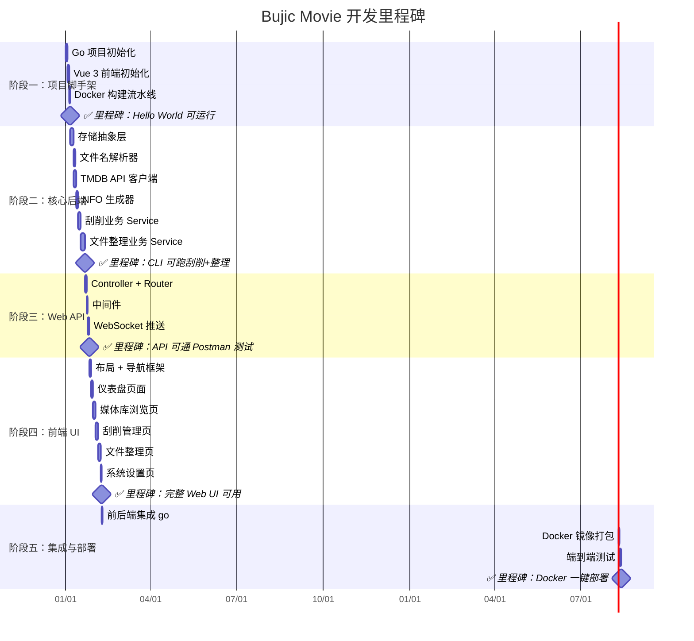

# Bujic Movie — 任务执行计划

> **目标**：基于架构设计文档，分阶段、可验证地完成项目开发。每个阶段输出可运行的交付物。

---

## 阶段总览



---

## 阶段一：项目脚手架搭建

> **目标**：搭建前后端项目骨架，跑通 "Hello World" 和 Docker 构建流水线。

### 任务 1.1 — Go 后端项目初始化

| 项目 | 内容 |
|:---|:---|
| **输入** | 无（从零开始） |
| **输出** | 可运行的 Go Gin 服务，监听 8080 端口，返回 `{"status": "ok"}` |

**具体步骤**：
1. 初始化 Go Module：`go mod init github.com/bujic-movie/bujic-movie`
2. 创建目录骨架：`cmd/server/`、`internal/`（config / middleware / router / controller / service / repository / model / storage）、`pkg/`
3. 编写 `cmd/server/main.go`：
   - 加载配置（configs/config.yaml）
   - 初始化 GORM + SQLite（数据库文件路径可配置）
   - 创建 Gin Engine + 注册全局中间件（Logger、Recovery、CORS）
   - 注册健康检查路由 `GET /api/v1/health`
   - 启动监听
4. 编写 `internal/config/config.go`：YAML 配置结构体 + Viper 加载
5. 编写 `internal/middleware/`：基础 CORS + Logger + Recovery 中间件
6. 编写 `internal/router/router.go`：路由注册框架
7. 创建 `configs/config.yaml.example`

**验证方式**：
```bash
go run ./cmd/server
curl http://localhost:8080/api/v1/health
# 期望返回: {"status": "ok"}
```

---

### 任务 1.2 — Vue 3 前端项目初始化

| 项目 | 内容 |
|:---|:---|
| **输入** | 无 |
| **输出** | 可运行的 Vite 开发服务器，展示 shadcn-vue 欢迎页 |

**具体步骤**：
1. 在 `web/` 下使用 Vite 初始化 Vue 3 + TypeScript 项目
2. 安装并配置 Tailwind CSS
3. 运行 `shadcn-vue init` 配置组件库
4. 安装核心依赖：Vue Router、Pinia、Axios
5. 配置 `vite.config.ts`：
   - 路径别名 `@` → `src/`
   - API 代理：`/api` → `http://localhost:8080`
   - 构建输出目录：`../dist`（供 go:embed 使用）
6. 创建基础布局组件：`AppLayout.vue`、`AppSidebar.vue`、`AppHeader.vue`
7. 创建路由配置：首页重定向到 `/dashboard`
8. 添加若干 shadcn-vue 基础组件：Button、Card、Input、ScrollArea

**验证方式**：
```bash
cd web && npm run dev
# 浏览器访问 http://localhost:5173
# 期望：展示带侧边栏 + 顶栏的布局框架
```

---

### 任务 1.3 — Docker 构建流水线

| 项目 | 内容 |
|:---|:---|
| **输入** | 任务 1.1 + 1.2 的代码 |
| **输出** | 可 `docker compose up` 运行的容器 |

**具体步骤**：
1. 编写 `deployments/Dockerfile`（三阶段构建：Node → Go → Alpine）
2. 编写 `deployments/docker-compose.yml`
3. 在 Go 入口中增加 `go:embed dist/*` 静态文件托管逻辑
4. 编写 `Makefile`：
   - `make dev-backend`：启动 Go 服务
   - `make dev-frontend`：启动 Vite
   - `make build`：前端构建 + Go 编译
   - `make docker`：构建 Docker 镜像
5. 编写 `.dockerignore` 和 `.gitignore`

**验证方式**：
```bash
make docker
docker compose -f deployments/docker-compose.yml up
curl http://localhost:8080/api/v1/health
# 浏览器访问 http://localhost:8080 看到 Vue 页面
```

---

## 阶段二：核心后端业务开发

> **目标**：实现刮削和文件整理的核心 Go 后端逻辑，此阶段可通过单元测试和 CLI 验证。

### 任务 2.1 — 存储抽象层实现

**目标**：参考 rclone 的 `Fs`/`Object` 接口模式，实现本地文件系统操作。

**具体步骤**：
1. 定义 `internal/storage/storage.go` 接口（Storage Interface）
2. 实现 `internal/storage/local/local.go`：
   - `List()` — 使用 `os.ReadDir` 列出目录
   - `Read()` / `Write()` — 使用 `os.Open` / `os.Create` 流式读写
   - `Copy()` — 使用 `io.Copy` 流式复制
   - `Move()` — 先 `os.Rename`，跨设备时 fallback 为 Copy + Delete
   - `Link()` — 使用 `os.Link` 创建硬链接
   - `Symlink()` — 使用 `os.Symlink` 创建软链接
   - `Hash()` — 参考 go-hasher，使用 `io.Copy` + `sha256.New()` 流式哈希
   - `IsBluray()` — 检查 `BDMV/` 子目录是否存在
3. 实现 `internal/storage/registry.go`：存储后端注册/获取工厂
4. 编写 `pkg/fileutil/` 工具函数：
   - `walk.go`：递归遍历、按深度排序、视频/字幕文件过滤
   - `permission.go`：权限检查与修复（参考 MoviePilot 的 umask 处理）

**验证方式**：
```bash
go test ./internal/storage/... -v
go test ./pkg/fileutil/... -v
```

**边界覆盖**：
- ✅ 跨设备 Move fallback
- ✅ 蓝光原盘目录识别
- ✅ 大文件流式哈希（不全量加载内存）
- ✅ 权限统一处理

---

### 任务 2.2 — 文件名解析器

**目标**：从文件名/路径中提取影片名、年份、分辨率、季/集号等结构化信息。

**具体步骤**：
1. 实现 `pkg/parser/filename_parser.go`：
   - 正则匹配模式：支持 `电影名 (2024) [1080p].mkv`、`S01E05.xxx.mp4` 等常见格式
   - 提取字段：`Title`, `Year`, `Season`, `Episode`, `Resolution`, `Source`, `Codec`
   - 多集范围支持：`S01E01-E03` → Episodes [1, 2, 3]
2. 实现 `pkg/parser/subtitle_parser.go`：
   - 字幕语言识别：简中/繁中/日文/英文（参考 MoviePilot 优先匹配繁中的策略）
   - 字幕格式识别：`.srt`、`.ass`、`.ssa`、`.sub`
3. 编写详尽的单元测试（覆盖中文片名、英文片名、日文片名、特殊字符等）

**验证方式**：
```bash
go test ./pkg/parser/... -v -count=1
# 确保覆盖率 > 80%
```

---

### 任务 2.3 — TMDB API 客户端

**目标**：封装 TMDB API，支持搜索、详情查询和图片下载。

**具体步骤**：
1. 实现 `pkg/tmdb/client.go`：
   - HTTP 客户端封装（带 API Key、超时、重试）
   - 搜索影片：`SearchMovie(query string, year int) ([]MovieResult, error)`
   - 搜索剧集：`SearchTV(query string, year int) ([]TVResult, error)`
   - 获取详情：`GetMovieDetail(id int) (*MovieDetail, error)`
   - 获取详情：`GetTVDetail(id int) (*TVDetail, error)`
   - 获取图片：`GetImages(mediaType string, id int) ([]ImageInfo, error)`
2. 实现 `pkg/tmdb/model.go`：TMDB 返回的 JSON 数据模型
3. 实现 `pkg/tmdb/image.go`：
   - 图片 URL 拼装（poster/backdrop/logo + 多尺寸）
   - 流式分块下载（参考 MoviePilot 的 chunk 下载 + 临时文件机制）
4. 速率限制：使用 `golang.org/x/time/rate` 限制 API 调用频率

**验证方式**：
```bash
# 需要 TMDB API Key
TMDB_API_KEY=xxx go test ./pkg/tmdb/... -v
```

---

### 任务 2.4 — NFO 文件生成器

**目标**：根据 TMDB 数据生成符合 Kodi/Emby/Jellyfin 规范的 `.nfo` XML 文件。

**具体步骤**：
1. 实现 `pkg/nfo/generator.go`：
   - 电影 NFO：`GenerateMovieNFO(detail *tmdb.MovieDetail) ([]byte, error)`
   - 电视剧 NFO：`GenerateTVShowNFO(detail *tmdb.TVDetail) ([]byte, error)`
   - 季 NFO：`GenerateSeasonNFO(...) ([]byte, error)`
   - 集 NFO：`GenerateEpisodeNFO(...) ([]byte, error)`
2. 使用 Go `text/template` 或 `encoding/xml` 生成标准 XML
3. 在 `pkg/nfo/templates/` 中定义模板文件
4. 图片别名映射逻辑：`backdrop ↔ fanart`、`thumb ↔ landscape`

**验证方式**：
```bash
go test ./pkg/nfo/... -v
# 验证生成的 XML 符合 Kodi NFO 规范
```

---

### 任务 2.5 — 刮削业务 Service

**目标**：编排完整的刮削流程（识别 → 下载元数据 → 生成 NFO → 下载图片）。

**具体步骤**：
1. 实现 `internal/service/recognize_service.go`：
   - 通过文件名解析 → TMDB 搜索 → 自动匹配最佳结果
   - 支持手动指定 TMDB ID 覆盖自动识别
2. 实现 `internal/service/scrape_service.go`：
   - `ScrapeFile(path string, opts ScrapeOptions) error`
   - `ScrapeDirectory(path string, opts ScrapeOptions) error`
   - 电影分支：单文件 NFO / 目录 NFO / 蓝光原盘保护
   - 电视剧分支：tvshow.nfo / season.nfo / episode.nfo + 季图片过滤
   - 图片别名自动复制（兼容 Plex/Emby/Jellyfin）
   - 覆盖/跳过已存在文件的逻辑
3. 实现 `internal/repository/media_repo.go`：刮削记录持久化

**验证方式**：
```bash
go test ./internal/service/... -v
# 准备测试目录结构，验证 NFO 和图片文件是否正确生成
```

**边界覆盖**：
- ✅ 蓝光原盘不递归
- ✅ 季级图片按季号过滤
- ✅ 图片别名兼容多播放器
- ✅ 已存在文件不重复刮削（除非 overwrite=true）

---

### 任务 2.6 — 文件整理业务 Service

**目标**：实现文件从下载目录到媒体库的完整整理流程（路径计算 → 冲突决策 → 文件转移 → 字幕适配）。

**具体步骤**：
1. 实现 `internal/service/naming_service.go`：
   - 电影重命名：`电影名 (年份)/电影名 (年份) [分辨率].mkv`
   - 电视剧重命名：`剧集名 (年份)/Season 01/S01E01 - 集标题.mkv`
   - 蓝光原盘 TV：季目录 + Disc 盘符追加
   - 支持自定义重命名模板（Jinja-like 模板语法）
2. 实现 `internal/service/transfer_service.go`：
   - 任务队列管理（Go Channel + Worker Pool）
   - 路径计算：分类目录 + 重命名拼装
   - 覆盖冲突决策：`always` / `never` / `size` / `latest`
   - 调用 Storage 接口执行 copy/move/link/softlink
   - 字幕文件随行整理（`__rename_subtitles` 逻辑移植）
   - 整理后自动触发刮削
   - 批次防抖：同一种子的文件整理完后统一触发一次刮削
   - Move 模式：清理源头空目录
3. 实现 `internal/repository/transfer_history_repo.go`：整理历史记录

**验证方式**：
```bash
go test ./internal/service/... -v
# 准备模拟目录，验证文件整理结果（新路径、重命名）
```

**边界覆盖**：
- ✅ 4 种覆盖模式
- ✅ 蓝光原盘 TV 的 Disc 盘符
- ✅ 字幕语言识别（简繁优先级）
- ✅ latest 模式仅删同季同集视频文件
- ✅ 批次级防抖
- ✅ Move 模式尾部清理

---

## 阶段三：Web API 层

> **目标**：将核心业务通过 RESTful API 和 WebSocket 暴露给前端调用。

### 任务 3.1 — Controller + Router

**具体步骤**：
1. 实现 5 个 Controller：
   - `scrape_controller.go`：接收刮削请求、返回状态
   - `transfer_controller.go`：提交整理任务、预览、队列查询、历史查询
   - `media_controller.go`：媒体列表、详情、搜索
   - `setting_controller.go`：配置读写
   - `task_controller.go`：任务状态查询
2. 每个 Controller 注入对应 Service
3. 在 `router/router.go` 中按分组注册路由
4. 统一错误处理：`pkg/response/response.go`

**验证方式**：
```bash
go run ./cmd/server
# 使用 Postman/curl 逐个调用 API
```

---

### 任务 3.2 — 中间件完善

**具体步骤**：
1. JWT 鉴权中间件：`middleware/auth.go`
   - Token 生成/验证
   - 登录接口（简单用户名密码，配置文件中指定）
2. 请求限速中间件（防止 API 滥用）
3. 请求日志中间件（记录耗时、状态码）

---

### 任务 3.3 — WebSocket 实时推送

**目标**：任务进度实时推送到前端。

**具体步骤**：
1. 实现 WebSocket 连接管理器
2. 刮削进度事件：开始 → 处理中（当前文件）→ 完成/失败
3. 整理进度事件：入队 → 处理中（当前文件 + 进度百分比）→ 完成/失败
4. 前端 `useWebSocket.ts` 组合式函数对接

**验证方式**：
```bash
# 使用 websocat 或浏览器 DevTools 测试 WebSocket
websocat ws://localhost:8080/api/v1/ws
# 触发一个刮削任务，观察 WebSocket 消息推送
```

---

## 阶段四：前端 UI 开发

> **目标**：打造美观、响应式的媒体管理 Web 界面。遵循 `frontend-ui-ux` Skill 的高级设计美学。

### 任务 4.1 — 布局 + 导航框架

**设计方向**：
- **风格**：暗色 cinematic 主题，灵感来自 Plex/Jellyfin 的电影院质感
- **色调**：深蓝灰底色 + 琥珀/金色强调色
- **字体**：选择有个性的字体（如 Plus Jakarta Sans / DM Sans）
- **记忆点**：首页海报墙的渐变模糊背景 + 流畅的页面切换动画

**具体步骤**：
1. 设计全局 CSS 变量（暗色主题配色方案）
2. 实现 `AppLayout.vue`：左侧边栏 + 右侧内容区
3. 实现 `AppSidebar.vue`：导航菜单（仪表盘/媒体库/刮削/整理/设置）
4. 实现 `AppHeader.vue`：搜索栏 + 用户头像
5. 页面切换过渡动画

---

### 任务 4.2 — 仪表盘首页

**具体步骤**：
1. 统计卡片区：电影总数、电视剧总数、待整理数、最近活动
2. 最近添加的媒体海报横滑展示
3. 整理队列实时状态概览
4. 系统状态（磁盘用量）

---

### 任务 4.3 — 媒体库浏览页

**具体步骤**：
1. 媒体海报网格 `MediaGrid.vue`（响应式列数）
2. 媒体卡片 `MediaCard.vue`（海报 + 评分 + 年份 overlay）
3. 媒体详情面板 `MediaDetail.vue`（侧滑或弹窗）
4. 搜索 + 筛选（类型/年份/状态）
5. 分页或无限滚动

---

### 任务 4.4 — 刮削管理页

**具体步骤**：
1. 文件/目录选择器 `FileBrowser.vue`（树形控件浏览服务器目录）
2. 刮削操作面板 `ScrapePanel.vue`：
   - 选择目标路径
   - 识别结果预览（TMDB 匹配）
   - 手动修正/选择正确媒体
   - 启动刮削
3. 刮削进度实时展示 `ScrapeProgress.vue`（WebSocket 驱动）
4. 刮削历史记录列表

---

### 任务 4.5 — 文件整理页

**具体步骤**：
1. 整理配置表单 `TransferConfig.vue`：
   - 源目录/目标目录选择
   - 转移模式（复制/移动/硬链/软链）
   - 覆盖策略（从不/总是/大覆小/保留最新）
   - 是否重命名 / 是否自动刮削
2. 预览功能：提交前展示"源路径 → 目标路径"对照表
3. 整理队列 `TransferQueue.vue`：实时进度（WebSocket）
4. 整理历史记录 `TransferHistory.vue`：成功/失败/文件列表

---

### 任务 4.6 — 系统设置页

**具体步骤**：
1. TMDB API Key 配置
2. 媒体库路径管理（电影/电视剧分类路径）
3. 下载目录配置
4. 重命名模板编辑
5. 转移模式默认值
6. 用户账户/密码修改

---

## 阶段五：集成、测试与部署

> **目标**：前后端合体、Docker 镜像打包、端到端验证。

### 任务 5.1 — 前后端集成

**具体步骤**：
1. 确认 Vite 构建输出到 `dist/` 目录
2. Go 端 `go:embed all:dist` 嵌入静态文件
3. Gin 配置 SPA 路由回退（NoRoute → index.html）
4. 静态资源缓存头设置
5. 验证：单个 Go 二进制同时提供 API + 前端页面

---

### 任务 5.2 — Docker 镜像打包

**具体步骤**：
1. 优化 Dockerfile（减小镜像体积）
2. docker-compose.yml 完善（volume 挂载、环境变量）
3. 健康检查配置
4. 编写 README.md Docker 部署指南

---

### 任务 5.3 — 端到端测试

**测试场景清单**：

| # | 场景 | 操作 | 预期结果 |
|:--|:--|:--|:--|
| 1 | Docker 首次启动 | `docker compose up` | 服务正常启动，可访问 Web UI |
| 2 | 配置 TMDB | 在设置页填入 API Key | 保存成功，搜索功能可用 |
| 3 | 单文件刮削 | 选择一个电影文件，点击刮削 | 生成同名 .nfo + 下载海报图片 |
| 4 | 目录批量刮削 | 选择一个电视剧目录 | 递归生成 tvshow.nfo / season.nfo / episode.nfo |
| 5 | 蓝光原盘刮削 | 选择含 BDMV 的目录 | 仅刮削根目录，不递归进入 BDMV |
| 6 | 电影文件整理 | 配置源/目标目录，选择电影文件 | 文件按命名规则转移到目标目录 |
| 7 | 电视剧批量整理 | 整理一整季（如 24 集） | 队列并发处理，完成后统一触发一次刮削 |
| 8 | 硬链接模式 | 选择 link 模式整理 | 创建硬链接而非复制，源文件不变 |
| 9 | 覆盖冲突-size | 源文件比目标大 | 覆盖成功 |
| 10 | 覆盖冲突-size | 源文件比目标小 | 跳过，不覆盖 |
| 11 | 字幕随行 | 整理带外挂字幕的文件 | 字幕文件正确重命名并随行转移 |
| 12 | 预览模式 | 点击预览按钮 | 展示路径对照表，不执行实际操作 |
| 13 | WebSocket 进度 | 执行批量任务 | Web UI 实时显示进度更新 |

---

## 附录：技术要点速查

### A. 关键 Go 依赖包

```
github.com/gin-gonic/gin           # Web 框架
gorm.io/gorm                       # ORM
gorm.io/driver/sqlite              # SQLite 驱动
github.com/gorilla/websocket       # WebSocket
github.com/spf13/viper             # 配置管理
github.com/golang-jwt/jwt/v5       # JWT 鉴权
golang.org/x/time/rate             # 速率限制
```

### B. 关键前端依赖包

```
vue@3                              # Vue 3
vue-router@4                       # 路由
pinia                              # 状态管理
axios                              # HTTP 客户端
shadcn-vue                         # UI 组件库
tailwindcss                        # 原子化 CSS
@vueuse/core                       # 组合式工具集
lucide-vue-next                    # 图标库
```

### C. MoviePilot 边界逻辑移植清单

以下是从 MoviePilot 分析中提炼的需要在 Go 中重新实现的关键边界逻辑：

| 边界场景 | MoviePilot 原代码位置 | Go 实现位置 |
|:---|:---|:---|
| 蓝光原盘防破坏 | `media.py` → `is_bluray_folder` | `storage/local/local.go` → `IsBluray()` |
| 季/根目录防混淆 | `_initialize_tv_directory_metadata` | `service/scrape_service.go` |
| 图片别名复制 | `_expand_with_aliases` | `service/scrape_service.go` |
| 季级图片过滤 | `_scrape_images_generic` | `service/scrape_service.go` |
| TV 蓝光 Disc 追加 | `__get_tv_bluray_dir_path` | `service/naming_service.go` |
| 4 种覆盖决策 | `transfer_media` | `service/transfer_service.go` |
| latest 仅删视频 | `__delete_version_files` | `service/transfer_service.go` |
| 字幕简繁优先级 | `__rename_subtitles` | `pkg/parser/subtitle_parser.go` |
| 批次防抖聚合 | `__register_scrape_batch_task` | `service/transfer_service.go` |
| Move 尾部清理 | `is_torrent_success` → `remove_torrents` | `service/transfer_service.go` |
